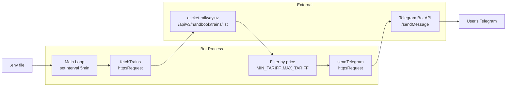

# Architecture

## Overview

`train-monitor` is a stateless single-process Node.js polling bot. It periodically queries the eticket.railway.uz API for available train seats on a specific route and date, then sends Telegram notifications — a silent summary every poll, and a loud alert when cheap seats are found.

## System Diagram

## Components

### Main Loop (`index.js`)
- **Purpose**: Entry point; starts polling, handles graceful shutdown
- **Location**: `index.js`
- **Depends on**: `fetchTrains`, `sendTelegram`, env vars
- **Exposes**: Nothing (run directly with `node index.js`)

### fetchTrains
- **Purpose**: POST to eticket.railway.uz and return raw train list
- **Location**: `index.js`
- **Depends on**: `httpsRequest`
- **Returns**: `{ status, data }` with full API response

### sendTelegram
- **Purpose**: Send a message to the configured Telegram chat
- **Location**: `index.js`
- **Depends on**: `httpsRequest`, `TELEGRAM_BOT_TOKEN`, `TELEGRAM_CHAT_ID`
- **Params**: `message: string`, `silent: boolean`

### checkTrains (poll handler)
- **Purpose**: Fetch trains, filter by price, send appropriate Telegram messages
- **Location**: `index.js`
- **Called by**: Main loop (setInterval) and once on startup

## Data Flow

1. `setInterval` fires every 5 minutes → `checkTrains()`
2. `fetchTrains()` POSTs to railway API with hardcoded route + date
3. Response is parsed: iterate trains → cars → tariffs, find `freeSeats > 0`
4. All available seats → silent Telegram summary
5. Seats in `[MIN_TARIFF, MAX_TARIFF]` → loud Telegram alert

## External Dependencies
| Service | Purpose | Auth |
|---------|---------|------|
| eticket.railway.uz | Train seat availability | XSRF token (static) |
| api.telegram.org | Send notifications | Bot token (env var) |

## Security Considerations
- Bot token and chat ID stored in `.env`, never committed
- No user input — all config is from env vars
- XSRF token is a static placeholder (API accepts it without real session)
